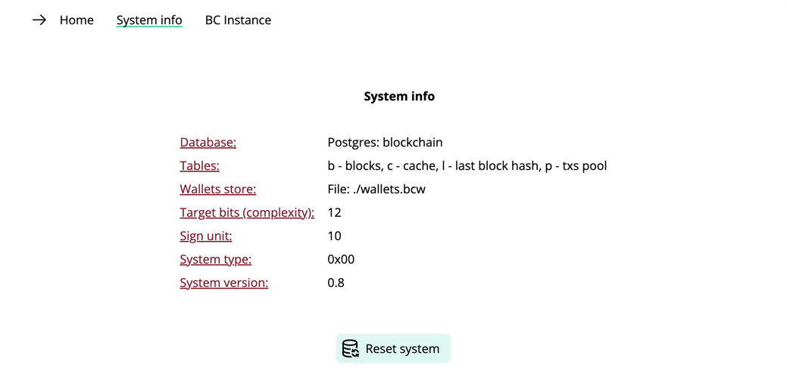
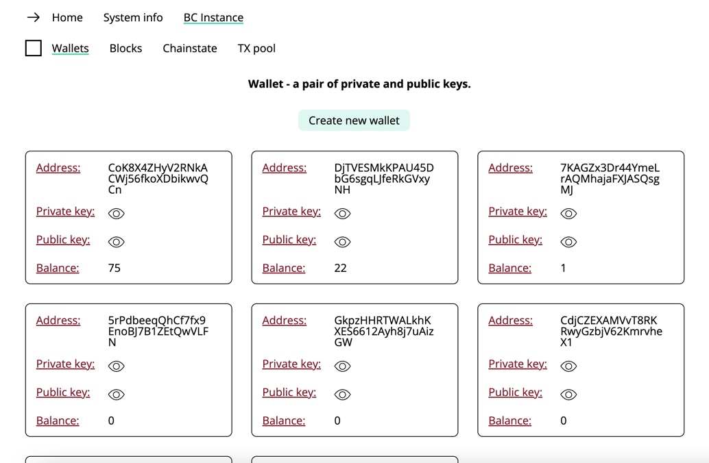
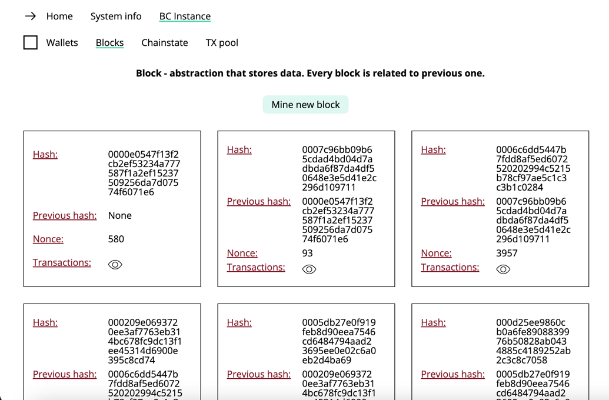
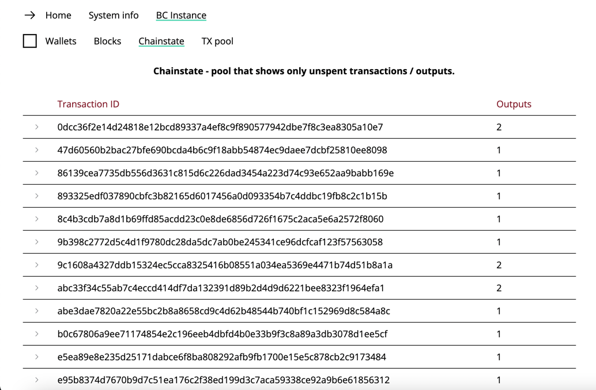
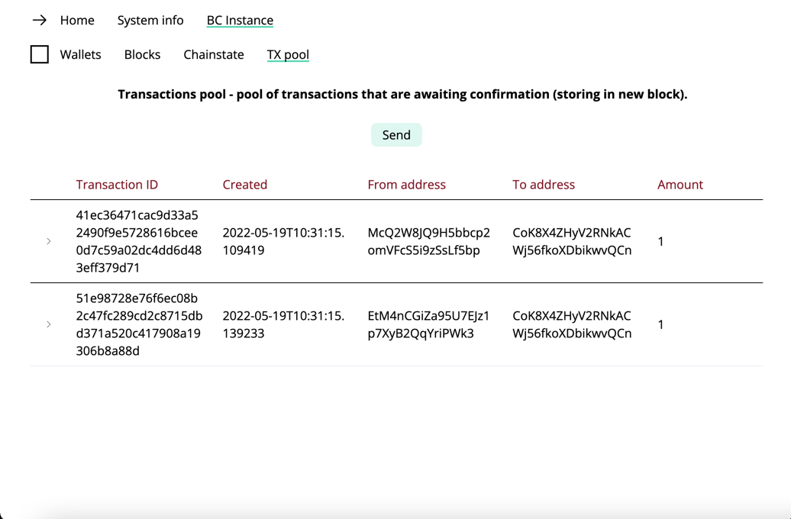

# Pocket-Blockchain
Pocket-Blockchain is a blockchain system built from scratch, developed for the further integration in different projects, understanding some blockchain concepts by using test stand or just having fun experiments.


## <ins>Tech stack</ins>
- Python 
- Python Flask 
- Flask SQLAlchemy 
- PostgreSQL 
- Vite + Vue.js 3 + Vue router + Pinia 
- Gunicorn 
- Nginx 
- Docker + Docker Compose 

## <ins>Under the hood</ins>
### Chain component:
 - communication of all system components;
 - setting the initial system settings;
 - setting the complexity of creating blocks based on the PoW algorithm;
 - setting a reward for creating a new block based on the PoW algorithm.

### Wallet component:
 - users creation;
 - users anonymity;
 - users storage. This item is implemented for informational and debugging purposes, however, in real conditions, there should not be any users storage;
 - serialization and deserialization of users. This item is implemented for informational and debugging purposes, however, in real conditions, there should not be any storage of users.

### Transaction component:
 - transactions creation;
 - blocking users until transaction is confirmed;
 - placing transactions in a pool of unconfirmed transactions;
 - balance check;
 - signature of transactions;
 - verification of transaction signatures;
 - verification of ownership of transactions;
 - transaction authentication; 
 - serialization and deserialization of transactions. 

### Block component:
 - creation of new blocks;
 - getting available blocks;
 - use of Proof of Work algorithm to create a unique block hash identifier;
 - confirmation of Proof of Work algorithm;
 - serialization and deserialization of data blocks.

### Chainstate component:
 - processing of unspent transactions of system users - cache;
 - cache serialization and deserialization.

### Merkle Tree component:
 - creation of a unique hash identifier for all transactions stored in the block.

### DB and API component:
 - storage and processing of the system state;
 - providing API methods for interacting with the system.

## <ins>Database</ins>
A relational database is used to store the state of the system. Database tables have the following structure:
 - Table b - storage of data blocks;
 - Table l - storage of the hash identifier of the last block;
 - Table c - cache storage;
 - Table p - storage of a pool of unconfirmed transactions.

## <ins>API</ins>
```
[GET]: /api/get_wallets - gell all wallets with balances.
[GET]: /api/get_blocks - get all blocks.
[GET]: /api/get_chainstate - get chainstate (cache - unspent transactions).
[GET]: /api/get_pool - get transactions pool (unconfirmed transactions).

[POST]: /api/new_wallet - creation of a new wallet.
[POST] {from, to, amount}: /api/send - send sign units from someone to someone.
[POST] {address, txAmount}: /api/mine_block - mine new block with amount of tranactions.
[POST]: /api/reset_system - system reset with training data generation.
```

## <ins>Methods</ins>
```python
new_wallet # create new wallet

init_system(address) # init system by address

get_balance(address) # get user balance 

send(from, to, amount) # send some amount if sign unit from someone to someone

mine_block(amount) # mine block with amount of transactions specified

show_blocks # show all information of all blocks
```

## <ins>Usage Example</ins>
```python
# Example

# Import BlockChain and db to create blockchain system instance
from app.blockchain_app.blockchain import BlockChain
from app.app import db

# Create blockchain system instance by passing db instance
bc = BlockChain(db)

# Create wallets
address1 = bc.new_wallet()
address2 = bc.new_wallet()
address3 = bc.new_wallet()
address4 = bc.new_wallet()
address5 = bc.new_wallet()
address6 = bc.new_wallet()
address7 = bc.new_wallet()
address8 = bc.new_wallet()

# Init blockchain system, 10 sign units (our coins) - reward
bc.init_system(address1)

# Get balance of address1.
# address1 should have 10 sign units.
bc.get_balance(address1)

# We can send sign units that we have to someone.
# All we need is to know the address. 
# That is how transactions are created and added to the pool - pool of unconfirmed transactions.
# Once a new transaction is created and added to pool, you can not use your wallet to
# create new transactions until it confirmed (added to a new block).
bc.send(address1, address2, 3)
bc.mine_block(address1)
bc.get_balance(address1)
#
bc.send(address1, address3, 2)
bc.mine_block(address1)
bc.get_balance(address1)
#
bc.send(address1, address4, 1)
bc.mine_block(address1)
bc.get_balance(address1)
#
bc.send(address1, address5, 1)
bc.mine_block(address1)
bc.get_balance(address1)
#
bc.send(address1, address6, 1)
bc.mine_block(address1)
bc.get_balance(address1)
#
bc.send(address1, address7, 1)
bc.mine_block(address1)
bc.get_balance(address1)
#
bc.send(address1, address8, 1)
bc.mine_block(address1)
bc.get_balance(address1)

# Sending sign units
bc.send(address2, address1, 1)
bc.send(address3, address1, 1)
bc.send(address4, address1, 1)
bc.send(address5, address1, 1)
bc.send(address6, address1, 1)
bc.send(address7, address1, 1)
bc.send(address8, address1, 1)

# After all (in this example) we have 7 transactions in pool from 7 different wallets.
# We can create two blocks: one with 2 transactions, one with 3 transactions in a block (5 - default).
# There will be 2 transactions in a pool (not verified).
bc.mine_block(address2, 2)
bc.mine_block(address2, 3)

# Balances
bc.get_balance(address1) # 75
bc.get_balance(address2) # 22
bc.get_balance(address3) # 1
bc.get_balance(address4) # 0
bc.get_balance(address5) # 0
bc.get_balance(address6) # 0
bc.get_balance(address7) # 1
bc.get_balance(address8) # 1

# Get all information about all blocks in blockchain system
bc.show_blocks()
```

## <ins>Build</ins>
You can build this project with Docker + Docker Compose by using [build.sh](./docker_build/build.sh) script:
```bash
pwd
.../pocket-blockchain
cd docker_build
source build.sh
docker ps
...  IMAGE                    PORTS                                       NAMES
...  pocket_blockchain_app    0.0.0.0:5001->5001/tcp, :::5001->5001/tcp   app
...  postgres                 0.0.0.0:5432->5432/tcp, :::5432->5432/tcp   db
...  pocket_blockchain_nginx  0.0.0.0:80->80/tcp, :::80->80/tcp           nginx
```
Or by running this command from the [docker_build](./docker_build) directory:
```bash
pwd
.../pocket-blockchain
cd docker_build
docker-compose --project-name pocket_blockchain up -d --build --force-recreate
docker ps
...  IMAGE                    PORTS                                       NAMES
...  pocket_blockchain_app    0.0.0.0:5001->5001/tcp, :::5001->5001/tcp   app
...  postgres                 0.0.0.0:5432->5432/tcp, :::5432->5432/tcp   db
...  pocket_blockchain_nginx  0.0.0.0:80->80/tcp, :::80->80/tcp           nginx
```

## <ins>Test stand</ins>
After project build or start up you can use test stand. Just go to:
```
localhost
```
or
```
127.0.0.1
```
Test stand uses all supported API methods, so that you can try this system / interact with system.

Test stand will look like this:






